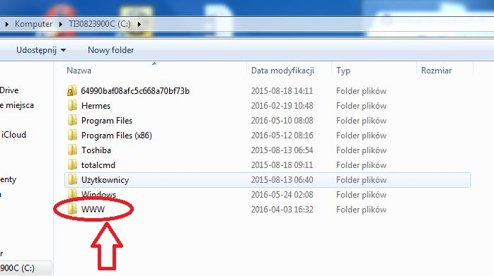

# Repozytorium

## Strona WWW

Programy:

  1. Płatny - "WebSite X5"
  2. Bezpłatny - "Total Commander"

**Program 1 ściągniemy tu:** http://www.websitex5.com/pl/demo---thanks-2.html

**Program 2 ściągniemy tu:** http://www.totalcommander.pl/pobierz-total-commander/

  W programie **WebSite X5** przygotujemy sobie w prosty sposób stronę internetową (możemy opracować ją sami od podstaw w formie graficznej lub z gotowych szablonów) - zapisujemy stworzony projekt na dysku C: - u mnie wygląda to tak:
  
  -------------------------------------------------------------------------------------------------------------------

 

Teraz musimy umieścić nasze "wypociny" na zewnętrznych serwerach - np. https://www.nazwa.pl/

**Tam też rejestrujemy domenę i wybieramy hosting:**

 -------------------------------------------------------------------------------------------------------------------

![zdjęcie] (Zdjęcie_2.JPG)

**Wybieramy Hosting** - tu trzeba trochę wydać na abonament roczny:

 -------------------------------------------------------------------------------------------------------------------

![zdjęcie] (Zdjęcie_3.JPG)

**Teraz przejdziemy do konfiguracji programu Total Commander.** Na przykładize strony [FPCP](http://www.psychotraumatologia.com.pl/)

 -------------------------------------------------------------------------------------------------------------------
![zdjęcie] (Zdjęcie_4.JPG)

  Ze strony www.nazwa.pl z zakładki [Panel Klienta](https://konto.nazwa.pl/zaloguj-sie.html?redirectUrl=https%3A%2F%2Fpanel.nazwa.pl%2F&skipGenerateAutologinToken=1); otrzymamy wszystkie potrzebne dane do utworzenia nowego połączenia FTP - u mnie wygląda to tak:
  
  -------------------------------------------------------------------------------------------------------------------
  ![zdjęcie] (Zdjęcie_5.JPG)

    Teraz wystarczy skopiować zawarośc naszej utworzonej strony www na serwer nazwa.pl za pomocą Total Commandera przez FTP
    Prosto - po Polsku i dla początkujących w zupełności wystarczy. Miłej nauki i zabawy.

  Ilość Programów    |        Koszt       |       Język
:-------------------:|:-------------------|-------------------:
                   WebSite X5 |    250 PLN         |     Polski
                   Total Commander |      0 PLN         |     Polski
